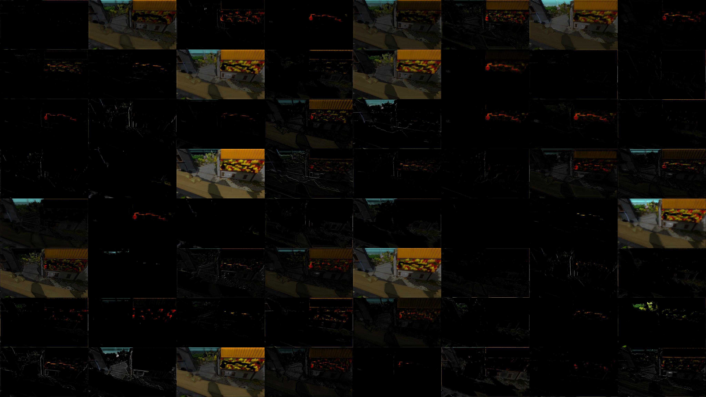

# Finding The Witness Puzzle Patterns

This repo is example code and data for training a CNN to identify patterns from the video game "The Witness", using python3 and tensorflow 1.13.



To train the model:

```sh
# Optional: create a virtualenv
pyenv virtualenv 3.6.4 witness-3.6
pyenv local witness-3.6
echo witness-3.6 > .python-version

# Install requirements.
pip install -r requirements.txt

# Install tensorflow GPU support if needed
pip install tensorflow-gpu

# Link to W&B -- this will save your run results.
wandb init

# Process data from /data/all into a training set in /data/train and validation set in /data/valid.
./process.py

# Train your model, and save the best one into the /model folder!
./train.py
```

To visualize output:

```sh
# Run a prediction on all entries in your validation set.
./predict.py

# Generate a visualization of every layer in the model.
./visualize.py
```
